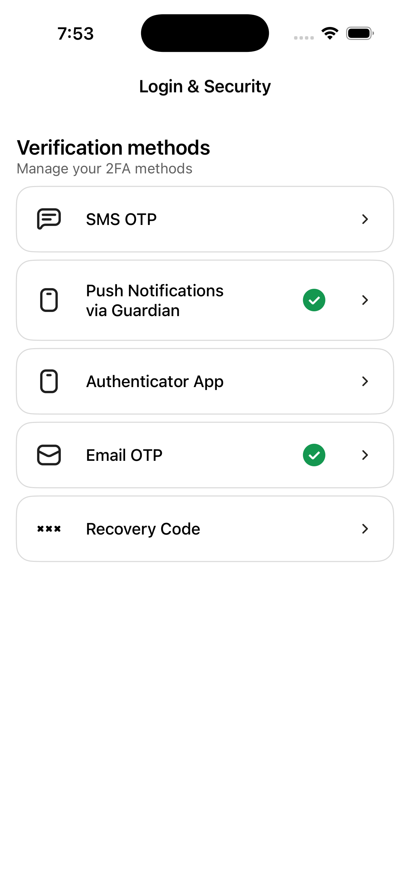
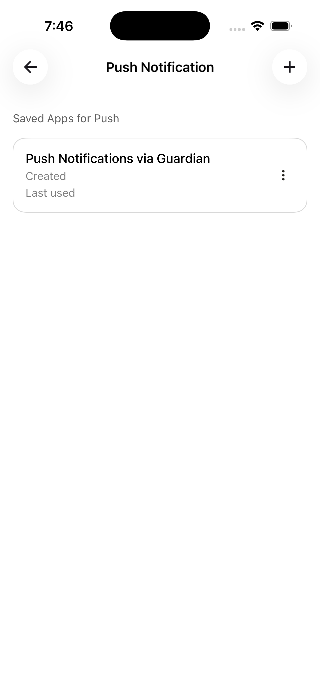

[](https://codecov.io/github/auth0/ui-components-ios)
[](https://deepwiki.com/auth0/ui-components-ios)


📚 [Documentation](#documentation) • 🚀 [Getting Started](#getting-started) • 💻 [Sample App](#running-the-sample-app) • 📃 [**Support Policy**](#support-policy) • 💬 [**Feedback**](#feedback)

## Documentation

Composable UI building blocks for MFA enrollment and verification on iOS, built with SwiftUI Compose. This library provides ready-to-use components that integrate seamlessly with Auth0's authentication flows.
- [Sample App](https://github.com/atko-cic/ui-components-ios/tree/main/AppUIComponents)
- [API Documentation](#) <!-- Add link when available -->

## Features

This library provides ready-to-use UI components for multi-factor authentication:

- 🔐 **TOTP (Time-based One-Time Password)** - Authenticator app support with QR code enrollment
- 📱 **Push Notifications** - Secure push-based authentication
- 💬 **SMS OTP** - Phone number verification via one-time codes
- 📧 **Email OTP** - Email-based verification
- 🔑 **Recovery Codes** - Backup authentication codes for account recovery

All components are built on top of the [Auth0 Swift SDK](https://github.com/auth0/Auth0.swift) and integrate with Auth0's My Account APIs.

> ⚠️ **BETA RELEASE** - This SDK is currently in beta. APIs may change before the stable release.

## Getting Started

### Requirements

- iOS 16.0+
- macOS 14.0+
- visionOS 1.0+
- Swift 6.0+
- Xcode 26.0+

### Installation

#### CocoaPods

Add the following to your `Podfile`:

```ruby
pod 'Auth0UIComponents'
```

Then run `pod install`.

#### Swift Package Manager

Add the following to your `Package.swift`:

```swift
.package(url: "https://github.com/auth0/ui-components-ios.git", from: "1.0.0")
```

Or use Xcode: File → Add Packages → Enter the repository URL.

#### Carthage

Add the following to your `Cartfile`:

```
github "auth0/ui-components-ios"
```

### Configure the SDK

#### Step 1: Configure Auth0 Credentials

You can configure the SDK in two ways:

#### Option A: Using Auth0.plist (Recommended)

1. Create `Auth0.plist` in your Xcode project:

```xml
<?xml version="1.0" encoding="UTF-8"?>
<!DOCTYPE plist PUBLIC "-//Apple//DTD PLIST 1.0//EN" "http://www.apple.com/DTDs/PropertyList-1.0.dtd">
<plist version="1.0">
<dict>
    <key>Domain</key>
    <string>YOUR_AUTH0_DOMAIN.auth0.com</string>
    <key>ClientId</key>
    <string>YOUR_AUTH0_CLIENT_ID</string>
</dict>
</plist>
```

2. Ensure `Auth0.plist` is added to your target's Build Phases.

#### Option B: Programmatic Configuration

Pass your credentials directly during initialization.

### Step 2: Initialize Auth0Dependencies in Your App

Initialize `Auth0Dependencies` in your app's entry point. This **must be done before** using any UI components.

```swift
import SwiftUI
import Auth0UIComponents

// Custom token provider
struct YourTokenProvider: TokenProvider {
    func fetchAPICredentials(audience: String, scope: String) async throws -> APICredentials {
        // Your custom logic to retrieve access token
    }
}

@main
struct MyApp: App {
    init() {
        // Initialize with Auth0.plist
        Auth0UIComponentsSDKInitializer.initialize(tokenProvider: YourTokenProvider())
        // OR initialize programmatically
        //Auth0UIComponentsSDKInitializer.initialize(session: URLSession = .shared,
        //                                           bundle: Bundle = .main,
        //                                           domain: "your-auth0-domain",
        //                                           clientId: "your_client_id",
        //                                           audience: "https://your-auth0-domain.auth0.com/me/",
        //                                           tokenProvider: YourTokenProvider())
    }

    var body: some Scene {
        WindowGroup {
            ContentView()
        }
    }
}
```

### Step 3: Use UI Components

Once initialized, you can use any of the provided UI components in your views:

```swift
import SwiftUI
import Auth0UIComponents

struct ContentView: View {
    var body: some View {
        NavigationView {
            List {
                NavigationLink(destination: MyAccountAuthMethodsView()) {
                    Text("Authentication Methods")
                }
            }
            .navigationTitle("Account Settings")
        }
    }
}
```

### Universal Login Step-Up Flow

This SDK uses **Universal Login** for step-up authentication flows. When an MFA-required error is encountered, the SDK automatically initiates a step-up flow to allow users to complete the required MFA challenge.

#### Prerequisites for Universal Login

To enable the step-up flow, configure the following in your Auth0 Tenant:

1. **Associated Domains** - Add your app's associated domain to your Auth0 application settings
2. **Callback URLs** - Configure the following in your Auth0 application:
   - Add your app's callback URL (e.g., `com.yourcompany.yourapp://YOUR_AUTH0_DOMAIN/ios/com.yourcompany.yourapp/callback`)
   - Ensure it matches your app's URL scheme and associated domain configuration

#### Configuration Steps

1. In your Xcode project, enable Associated Domains capability
2. Add your domain entitlement (e.g., `applinks:YOUR_AUTH0_DOMAIN.auth0.com`)
3. Configure your Auth0 application settings with the callback URL
4. The SDK will automatically handle the Universal Login flow when MFA is required

For more detailed information on Universal Login configuration, associated domains, and callback URL setup, refer to the [Auth0.swift SDK documentation](https://github.com/auth0/Auth0.swift/blob/master/README.md).

### Components

#### Authentication Methods
Display and manage user's authentication methods.

```swift
MyAccountAuthMethodsView()
```

Allows users to:
- View connected authenticators
- Enroll in new authentication methods (TOTP, Push, Email, SMS, Recovery Code)
- Remove authentication methods

#### Screenshots

| Authentication Methods | Manage Auth Methods |
|:---:|:---:|
|  |  |
| View connected authenticators | Delete/Add MFA |

## Sample App

This repository includes a sample app (`AppUIComponents` target) that demonstrates how to use the Auth0 UI Components SDK. You can use the sample app to explore the SDK's features and test the MFA components.

### Running the Sample App

1. **Clone the repository:**
   ```bash
   git clone https://github.com/auth0/ui-components-ios.git
   cd ui-components-ios
   ```

2. **Install dependencies using Carthage:**
   ```bash
   carthage bootstrap --use-xcframeworks
   ```

3. **Configure Auth0 credentials:**
   - Open `AppUIComponents/Auth0.plist`
   - Update with your Auth0 tenant information:
     ```xml
     <dict>
         <key>Domain</key>
         <string>YOUR_AUTH0_DOMAIN.auth0.com</string>
         <key>ClientId</key>
         <string>YOUR_AUTH0_CLIENT_ID</string>
         <key>Audience</key>
         <string>https://YOUR_AUTH0_DOMAIN.auth0.com/api/v2/</string>
     </dict>
     ```

4. **Open the project in Xcode:**
   ```bash
   open Auth0UIComponents.xcodeproj
   ```

5. **Select the `AppUIComponents` target** from the scheme dropdown

6. **Build and run** the app on a simulator or physical device (Xcode 26.0+)

### Portions of this SDK may have AI-assisted or generated code.

## Support Policy

This Policy defines the extent of the support for Xcode, Swift, and platform (iOS, macOS, tvOS, and watchOS) versions in Auth0.swift.

### Xcode

The only supported versions of Xcode are those that can be currently used to submit apps to the App Store. Once a Xcode version becomes unsupported, dropping it from Auth0.swift **will not be considered a breaking change**, and will be done in a **minor** release.

### Swift

The minimum supported Swift minor version is the one released with the oldest-supported Xcode version. Once a Swift minor becomes unsupported, dropping it from Auth0.swift **will not be considered a breaking change**, and will be done in a **minor** release.

### Platforms

We support only the last four major versions of any platform, including the current major version.

Once a platform version becomes unsupported, dropping it from ui-components-ios **will not be considered a breaking change**, and will be done in a **minor** release. For example, iOS 14 will cease to be supported when iOS 18 gets released, and ui-components-ios will be able to drop it in a minor release.

In the case of macOS, the yearly named releases are considered a major platform version for the purposes of this Policy, regardless of the actual version numbers.

## Feedback

### Contributing

We appreciate feedback and contribution to this repo! Before you get started, please see the following:

- [Auth0's general contribution guidelines](https://github.com/auth0/open-source-template/blob/master/GENERAL-CONTRIBUTING.md)
- [Auth0's code of conduct guidelines](https://github.com/auth0/open-source-template/blob/master/CODE-OF-CONDUCT.md)
- [ui-components-ios's contribution guide](CONTRIBUTING.md)

### Raise an issue

To provide feedback or report a bug, please [raise an issue on our issue tracker](https://github.com/auth0/Auth0.swift/issues).

### Vulnerability reporting

Please do not report security vulnerabilities on the public GitHub issue tracker. The [Responsible Disclosure Program](https://auth0.com/responsible-disclosure-policy) details the procedure for disclosing security issues.

---

<p align="center">
  <picture>
    <source media="(prefers-color-scheme: light)" srcset="https://cdn.auth0.com/website/sdks/logos/auth0_light_mode.png" width="150">
    <source media="(prefers-color-scheme: dark)" srcset="https://cdn.auth0.com/website/sdks/logos/auth0_dark_mode.png" width="150">
    
  </picture>
</p>
<p align="center">Auth0 is an easy-to-implement, adaptable authentication and authorization platform. To learn more check out <a href="https://auth0.com/why-auth0">Why Auth0?</a></p>
<p align="center">
This project is licensed under the Apache License 2.0. See the <a href="./LICENSE">LICENSE</a> file for more info.<br>
Copyright 2025 Okta, Inc.<br>
Licensed under the Apache License, Version 2.0 (the "<a href="./LICENSE">License</a>");
you may not use this file except in compliance with the License.
You may obtain a copy of the License at<br>
&nbsp;&nbsp;&nbsp;&nbsp;<a href="http://www.apache.org/licenses/LICENSE-2.0">http://www.apache.org/licenses/LICENSE-2.0</a><br>
Unless required by applicable law or agreed to in writing, software
distributed under the License is distributed on an "AS IS" BASIS,
WITHOUT WARRANTIES OR CONDITIONS OF ANY KIND, either express or implied.
See the <a href="./LICENSE">License</a> for the specific language governing permissions and
limitations under the License.
</p>
